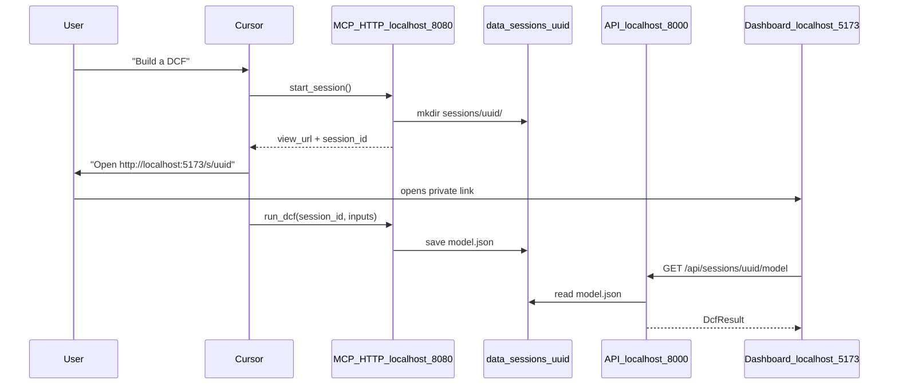

# MCP Financial Model Builder — Living Plan

## What this is

MCP server (HTTP) + dashboard where **Cursor/Claude orchestrates** and **Python computes**. Each user gets an anonymous **session ID** and private folder — no signup.

**Phase 1:** `start_session` + `run_dcf`, HTTP localhost, session-scoped storage.

---

## Status

| Phase | Status | Description |
|-------|--------|-------------|
| **1** | Done | HTTP MCP, anonymous sessions, DCF tools, session dashboard |
| **2** | In progress | SEC EDGAR fetch, Files sidebar, 1-hour session TTL |
| 3 | Later | Model-agnostic input bundles from SEC |
| 4 | Later | Excel export polish, production abuse prevention |

---

## Phase 1 — Session-based DCF prototype

### Goal

1. User connects Cursor to `http://localhost:8080/mcp`
2. Host calls `start_session` → user gets `http://localhost:5173/s/{uuid}`
3. Host collects inputs → `run_dcf(session_id, ...)` 
4. Model saved to `data/sessions/{uuid}/` — only that user sees it

### Flow

### Anonymous sessions (no login)

| Concept | Implementation |
|---------|----------------|
| User identity | Random UUID (`session_id`) |
| Storage | `backend/data/sessions/{session_id}/model.json` |
| Dashboard | `http://localhost:5173/s/{session_id}` |
| Security (demo) | Unguessable URL — like an unlisted Google Doc |
| Multi-user | Each session is isolated; no shared `latest_model.json` |

### MCP tools

| Tool | Purpose |
|------|---------|
| `start_session` | Create folder, return private dashboard link |
| `run_dcf` | Compute DCF, save to session folder |

### Local URLs (HTTP from day one)

| Service | URL |
|---------|-----|
| MCP | `http://localhost:8080/mcp` |
| API | `http://localhost:8000` |
| Frontend | `http://localhost:5173` |
| User dashboard | `http://localhost:5173/s/{session_id}` |

Cursor config uses `url`, not `command`/`args`.

### Deploy later

Swap `localhost` → public domain. Same architecture:

- `https://mcp.yourapp.com/mcp` — strangers add this to Cursor
- `https://app.yourapp.com/s/{session_id}` — their private dashboard

Set `VIEW_BASE_URL` env var on MCP server.

---

## What comes after Phase 1

| Phase | Focus |
|-------|-------|
| **2** | SEC EDGAR fetch via MCP; Files + Models sidebar; 1-hour session TTL on AWS |
| **3** | Model-agnostic variable bundles (SEC → inputs per model type) |
| **4** | Excel export; optional API keys for abuse prevention |
